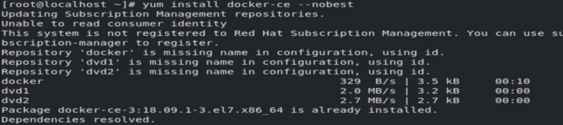

# ***Configuring HTTPD and Python on Top of Docker Container***

<p align="center">

</p>

### ***Task Aim:***
1. Configuring HTTPD Server on Docker Container </br>
2. Setting up Python Interpreter and running Python Code on Docker Container </br>

### ***Prerequisite:***
1. Basic Linux Command </br>

>## ***Task Description:***

>### ***Sub-task 1:***
1. Configure yum repository in order to install docker </br>
2. Install docker-ce in the host-OS </br>
3. Start the docker services </br>

>### ***Sub-Task 2:***
1. Pull a centos image from the docker repository </br>
2. Launch a centos container </br>
3. Install httpd software in the container </br>
4. Start the services </br>
5. Test the services are working or not </br>
6. Put the web content on the web server </br>
7. Test the services </br>

>### ***Sub-Task 3:***
1. Launch a centos container </br>
2. Install python3 in the container </br>
3. Launch the python interpreter to run  python functions and commands </br>

## ***So now lets Begin:👉***

***
### ***Sub-Task 1:***
In order to install the docker we are going to use the yum (you can also use dnf) to install docker

Yum or dnf is command in linux we can use to install any software it also installs any dependencies regarding the software for the user

But to install using yum or dnf we need to tell them from where they need to install the software. Typically we need to set the repository. They can actually download and install software from file, folder and url as well.

In my case I have given the url in the repository. And set the docker.repo file

<p align="center">

</p>

Now we need to install the docker-ce using the command
```
#yum install docker-ce — nobest
```
<p align="center">

</p>

Now we need to start the docker services in the base os. Using the command
```
#systemctl start docker
```

We can also enable the docker services permanently. With the command

```
#systemctl enable docker
```

Now to check the status of the docker services we can use

```
#systemctl status docker
```

<p align="center">

</p>

For checking the info regarding the docker we need to run command

```
#docker info
```
***
### ***Sub-Task 2:***

Now in order to achieve our task we need to install docker image to launch the container on top of it. Using the command
```
#docker pull centos
```
By default it pull the latest centos image from the docker hub

<p align="center">

</p>

Now we need to launch the container on the top of docker and then install the httpd using yum

```
#docker run -it — name MyWebOS centos:latest
```

Here -it provides us an interactive terminal of docker container and In my case I have given the name of container as MyWebOS

<p align="center">

</p>

Next we need to start httpd web server Now the challenge is systemctl command doesn’t work in docker container. But we know behind the seen systemctl run a file /usr/lib/systemd/system/httpd.service and in that the service is started using /usr/sbin/httpd/

Here to show this I ran systemctl on my baseos where a webserver is running and here we can see

<p align="center">

</p>
<p align="center">

</p>

So in docker we should start the services using this only as shown below

<p align="center">

</p>

In the docker also to know the IP of the container I have installed net-tools which have the ifconfig command in it to know systems IP

<p align="center">

</p>

Now after starting the services let’s test the services

<p align="center">

</p>

Now we need to put the web-content on the web server i.e in the /var/www/html

<p align="center">

</p>

After this when we again hit our web server it will show us the web-content

<p align="center">

</p>

***
### ***Sub-Task 3:***
Now In this task we need to install and run a python interpreter on top of docker container for this we need to launch a docker container

<p align="center">

</p>

We also need python3 to be installed in it for this we install python3 using yum

Now we can run the python interpreter inside the container

<p align="center">

</p>

### Hurray !! We Have successfully Configuring HTTPD Server and Set up Python Interpreter on Docker Container😃
### Thank You for Reading :)
### Any query and suggestion are always welcome- [Gaurav Pagare](https://www.linkedin.com/in/gaurav-pagare-8b721a193/)
